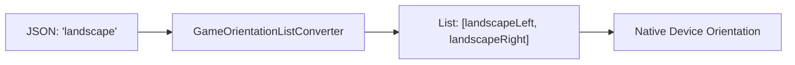

# 🏗️ Kiến trúc & Thiết kế — Casino Settings

Tài liệu này dành cho các nhà phát triển phần mềm (Software Engineers) để hiểu rõ cấu trúc bên trong, nguyên lý thiết kế và cách tích hợp package `caxilo_config` vào ứng dụng chính.

---

## 1. Nguyên lý Thiết kế (Design Principles)

Package được xây dựng dựa trên 4 trụ cột kỹ thuật:

1.  **Immutability (Tính bất biến)**: Sử dụng `freezed` cho toàn bộ các Data Models. Mọi thay đổi cấu hình đều tạo ra một instance mới, giúp tránh side-effects và tương thích hoàn hảo với các giải pháp quản lý trạng thái (Bloc, Provider).
2.  **Standardization (Chuẩn hóa)**: Hợp nhất các định nghĩa Enum (`GameType`, `GameOrientation`) và hằng số tài nguyên (`CaxiloGameImages`) dùng chung cho toàn bộ dự án.
3.  **Decoupling (Tách biệt logic)**: Tách biệt hoàn toàn tên file hình ảnh (managed by package) và đường dẫn gốc (managed by app). Điều này cho phép chuyển đổi linh hoạt giữa CDN và Local Assets mà không cần sửa code trong package.
4.  **Fail-safe (An toàn khi lỗi)**: Hệ thống luôn cung cấp giá trị mặc định cho mọi trường hợp dữ liệu bị thiếu hoặc sai định dạng từ server.

---

## 2. Cấu trúc Thư mục (Package Layout)

```text
packages/caxilo_config/
├── lib/
│   ├── caxilo_config.dart      # Barrel export (Public API)
│   └── src/
│       ├── client/               # Orchestrator & State Management
│       └── settings/             # Core Configuration Models
│           ├── in_house/         # In-house games (`InHouseGame`, `InHouseGameSettings`)
│           ├── external/         # 3rd-party integrations (`ExternalGame`, `ExternalProviderSettings`)
│           ├── common/           # Shared Enums & Utilities (`GameType`, `GameStatus`)
│           ├── presets/          # Hardcoded default settings (Environment-based)
│           ├── casino_category.dart      # Dynamic categories models
│           ├── casino_lobby_section.dart # Lobby sections rendering config
│           └── casino_game_images.dart   # Static Resources (Thumbnails)
└── test/                         # Hệ thống kiểm thử tự động
```

---

## 3. Thành phần Cốt lõi (Core Components)

### 🛰️ 3.1 CaxiloConfigClient
Đây là điểm truy cập duy nhất (Single Point of Entry) để lưu trữ và truy vấn cấu hình.
- **`CaxiloConfigClient.create(...)`**: Static factory method để khởi tạo client cùng với dữ liệu Presets (Offline-first) ngay lập tức dựa trên môi trường (`dev`, `staging`, `prod`).
- **`loadFromMap(Map data)`**: Nạp và chuyển đổi dữ liệu thô sang model chuẩn.
- **`sync()`**: Đồng bộ hóa dữ liệu từ URL cấu hình. Nếu lỗi, client sẽ giữ lại dữ liệu presets hoặc dữ liệu cũ để đảm bảo ứng dụng không bị crash.
- **`getGameUrl(String gameCode)`**: Giải quyết các tham số, token và base URL để trả về địa chỉ khởi chạy game.
- **`getAllInHouseGames()`**: Trả về danh sách game đã được lọc (visible) và sắp xếp đúng thứ tự.

### 🛡️ 3.2 CaxiloConfigPresets
Thay thế hệ thống JSON mock cũ. Cung cấp cấu hình mặc định (Hardcoded) cho từng môi trường dưới dạng code Dart, giúp:
- Đảm bảo tính toàn vẹn dữ liệu (Type-safe).
- Hỗ trợ Documentation comments trực tiếp trong presets.
- Khởi tạo ứng dụng tức thì không phụ thuộc network.

### 📦 3.3 CaxiloConfig (Data Tree)
Mô hình dữ liệu đã được làm phẳng để tăng khả năng mở rộng:
- **`CaxiloConfig`**: Root model chứa `updated_at`, `version`, `environments`, `display`, `categories`, `lobby_sections`, `in_house` và `external`.
- **`DisplaySettings`**: Chứa logic hiển thị toàn cục (`order`, `featured`, `new`).
- **`InHouseGameSettings`**: Chứa danh mục game (`catalog`) và trạng thái (`visibility`) của sảnh In-house.

---

## 4. Hướng dẫn Tích hợp (Integration Guide)

### 4.1 Quản lý Hình ảnh (Best Practice)
Đừng hardcode đường dẫn đầy đủ. Hãy sử dụng hằng số từ package và ghép nối với Base Path của App:

```dart
// Cách dùng chuẩn
final imageUrl = '$IMAGES_BASE_PATH/${CaxiloGameImages.sunwinScSunCa}';
```

### 4.2 Sử dụng Mixin trong BLoC/Notifier
Sử dụng `CaxiloConfigClient` để truy cập cấu hình:

```dart
class CaxiloLobbyBloc extends Bloc<LobbyEvent, LobbyState> with CaxiloConfigClient {
  void _onLoad() async {
    final games = await settingsClient.getAllInHouseGames();
    emit(LobbyLoaded(games: games));
  }
}
```

---

## 5. Mở rộng Hướng xoay (Orientation Logic)

Một điểm đặc biệt trong thiết kế là bộ chuyển đổi `GameOrientationListConverter`. Nó cho phép map các chuỗi rút gọn từ server sang danh sách hướng cụ thể của Flutter:



---
> [!TIP]
> Luôn chạy `dart run build_runner build --delete-conflicting-outputs` sau khi thay đổi bất kỳ file model nào để cập nhật mã nguồn tự động.
