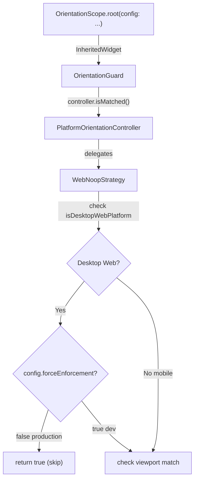

# 🛠 Kế Hoạch v1.x — Final (Fix Desktop Web + Debug Toggle)

> **Thời gian**: ~2-3 ngày | **Rủi ro**: Thấp | **Breaking change**: Không

---

## Tổng Quan Vấn Đề & Giải Pháp

| # | Vấn đề | Giải pháp |
|---|---|---|
| P0 | Desktop web resize nhỏ → hiện overlay sai | `isDesktopWebPlatform` detection (platform, không phải size) |
| P0.1 | DevTools emulate mobile không test được overlay | **Debug flag** `forceEnforcementOnDesktopWeb` |
| P1 | Message "Rotate device" sai trên Desktop | `OrientationExperience` classifier (shortestSide) |
| P2 | Resolver chỉ có 2 class | Mở rộng 4 class: mobile/tablet/largeTablet/desktop |

---

## Thiết Kế: Debug Flag

### Concept

```
Production (default):
  Desktop web → KHÔNG overlay (dù resize nhỏ)
  Mobile web  → Overlay khi mismatch

Dev testing (flag bật):
  Desktop web → XỬ LÝ NHƯ mobile → Overlay khi mismatch
  → Cho phép test bằng Chrome DevTools
```

### Nơi đặt flag: `OrientationGuardConfig`

Tạo config class đơn giản, inject qua `OrientationScope.root()`:

```dart
/// Global configuration for orientation guard behavior.
class OrientationGuardConfig {
  const OrientationGuardConfig({
    this.forceEnforcementOnDesktopWeb = false,
  });

  /// When `true`, desktop web browsers will be treated like mobile browsers
  /// for orientation enforcement. Useful for testing with Chrome DevTools
  /// device emulation.
  ///
  /// **Only enable during development.** In production, desktop web users
  /// should never see rotation overlays.
  ///
  /// Defaults to `false`.
  final bool forceEnforcementOnDesktopWeb;

  /// Default production config.
  static const production = OrientationGuardConfig();

  /// Dev/testing config — enables enforcement on desktop web.
  static const devTesting = OrientationGuardConfig(
    forceEnforcementOnDesktopWeb: true,
  );
}
```

### Cách sử dụng

```dart
// Production (default) — desktop web KHÔNG hiện overlay
OrientationScope.root(
  child: MaterialApp(...),
)

// Dev testing — desktop web CÓ hiện overlay (test DevTools)
OrientationScope.root(
  config: OrientationGuardConfig.devTesting,
  child: MaterialApp(...),
)

// Hoặc control qua biến môi trường
OrientationScope.root(
  config: OrientationGuardConfig(
    forceEnforcementOnDesktopWeb: kDebugMode, // tự bật khi debug
  ),
  child: MaterialApp(...),
)
```

### Luồng dữ liệu



---

## Proposed Changes (6 bước)

### Bước 1: [NEW] `models/orientation_experience.dart`

```dart
import 'package:flutter/foundation.dart';
import 'package:flutter/widgets.dart';

// ─── Experience Enum ───

enum OrientationExperience {
  mobile,
  tablet,
  largeTablet,
  desktop;

  /// Whether this device supports physical rotation.
  bool get canRotate => this == mobile || this == tablet;

  /// Whether orientation is controlled via window resize.
  bool get usesResize => !canRotate;
}

// ─── Classifier ───

class OrientationExperienceClassifier {
  const OrientationExperienceClassifier({
    this.mobileBreakpoint = 600.0,
    this.tabletBreakpoint = 1200.0,
    this.desktopBreakpoint = 1600.0,
  });

  final double mobileBreakpoint;
  final double tabletBreakpoint;
  final double desktopBreakpoint;

  static const standard = OrientationExperienceClassifier();

  OrientationExperience classify(BuildContext context) {
    return classifyFromSize(MediaQuery.sizeOf(context).shortestSide);
  }

  OrientationExperience classifyFromSize(double shortestSide) {
    if (shortestSide < mobileBreakpoint) return OrientationExperience.mobile;
    if (shortestSide < tabletBreakpoint) return OrientationExperience.tablet;
    if (shortestSide < desktopBreakpoint) return OrientationExperience.largeTablet;
    return OrientationExperience.desktop;
  }
}

// ─── Platform Detection ───

/// Whether current platform is a desktop web browser (not mobile web).
/// Uses `defaultTargetPlatform` which reflects actual OS, not viewport size.
bool get isDesktopWebPlatform {
  if (!kIsWeb) return false;
  return defaultTargetPlatform != TargetPlatform.iOS &&
      defaultTargetPlatform != TargetPlatform.android;
}
```

### Bước 2: [NEW] `models/orientation_guard_config.dart`

```dart
/// Global configuration for orientation guard behavior.
///
/// Pass to [OrientationScope.root] to customize enforcement rules.
class OrientationGuardConfig {
  const OrientationGuardConfig({
    this.forceEnforcementOnDesktopWeb = false,
  });

  /// When `true`, desktop web browsers are treated like mobile browsers
  /// for orientation mismatch enforcement.
  ///
  /// Use [devTesting] preset during development to test overlays
  /// with Chrome DevTools device emulation.
  ///
  /// Defaults to `false` (safe for production).
  final bool forceEnforcementOnDesktopWeb;

  /// Default production config.
  static const production = OrientationGuardConfig();

  /// Dev config — enables overlay on desktop web for testing.
  static const devTesting = OrientationGuardConfig(
    forceEnforcementOnDesktopWeb: true,
  );

  @override
  bool operator ==(Object other) =>
      identical(this, other) ||
      other is OrientationGuardConfig &&
          forceEnforcementOnDesktopWeb == other.forceEnforcementOnDesktopWeb;

  @override
  int get hashCode => forceEnforcementOnDesktopWeb.hashCode;
}
```

### Bước 3: [MODIFY] `OrientationScope` — nhận và truyền config

```diff
 class OrientationScope extends InheritedWidget {
   const OrientationScope({
     required this.controller,
     this.currentPolicy,
+    this.config = const OrientationGuardConfig(),
     required super.child,
   });

   OrientationScope.root({
     this.controller,
     this.currentPolicy,
+    this.config = const OrientationGuardConfig(),
     required super.child,
     // ... existing params
   });

   final OrientationController controller;
   final OrientationPolicy? currentPolicy;
+  final OrientationGuardConfig config;

+  /// Gets the [OrientationGuardConfig] from the nearest [OrientationScope].
+  static OrientationGuardConfig configOf(BuildContext context) {
+    final scope = context.dependOnInheritedWidgetOfExactType<OrientationScope>();
+    return scope?.config ?? const OrientationGuardConfig();
+  }
 }
```

### Bước 4: [MODIFY] `WebNoopStrategy.isMatched()` — dùng config

Strategy cần biết config. Có 2 cách:
- **Cách A**: Truyền config qua parameter `isMatched()` — thay đổi interface
- **Cách B**: Kiểm tra config ở tầng `OrientationGuard.build()` thay vì strategy

**Chọn Cách B** (không thay đổi Strategy interface):

```diff
 // Trong OrientationGuard.build():
 final isMatched = isApplying
     ? true
     : controller.isMatched(
         policy: widget.policy,
         currentOrientation: currentOrientation,
       );

+// Override: nếu desktop web + config cho phép force → bỏ qua skip
+// (WebNoopStrategy mặc định skip desktop, nhưng config có thể override)
+final config = OrientationScope.configOf(context);
+final effectiveMatched = isMatched ||
+    (!config.forceEnforcementOnDesktopWeb && _isStrategySkipping(widget.policy));
```

Thực tế đơn giản hơn — giữ logic trong `WebNoopStrategy` và truyền flag:

```diff
 // WebNoopStrategy — thêm optional config parameter
 class WebNoopStrategy implements OrientationStrategy {
-  const WebNoopStrategy();
+  const WebNoopStrategy({this.forceEnforcementOnDesktopWeb = false});
+
+  final bool forceEnforcementOnDesktopWeb;

   @override
   bool isMatched({
     required OrientationPolicy policy,
     required Orientation currentOrientation,
   }) {
-    if (policy.ignoreMismatchOnDesktop) {
-      final isMobile = defaultTargetPlatform == TargetPlatform.iOS ||
-          defaultTargetPlatform == TargetPlatform.android;
-      if (!isMobile) return true;
-    }
+    // Desktop web: skip mismatch unless forceEnforcement is enabled
+    if (isDesktopWebPlatform &&
+        policy.ignoreMismatchOnDesktop &&
+        !forceEnforcementOnDesktopWeb) {
+      return true;
+    }

     return policy.targets.any((target) {
       if (target.isPortrait) return currentOrientation == Orientation.portrait;
       if (target.isLandscape) return currentOrientation == Orientation.landscape;
       return false;
     });
   }
 }
```

Và truyền config khi tạo controller:

```diff
 // controller_dispatcher_web.dart
-OrientationController createOrientationControllerV1() {
+OrientationController createOrientationControllerV1({
+  OrientationGuardConfig config = const OrientationGuardConfig(),
+}) {
   final context = OrientationRuntimeContext.current();
-  final strategy = resolver.resolve(context);
+  final strategy = resolver.resolve(context, config: config);
   return PlatformOrientationController(strategy);
 }

 // orientation_strategy_resolver.dart
-OrientationStrategy resolve(OrientationRuntimeContext context) {
+OrientationStrategy resolve(
+  OrientationRuntimeContext context, {
+  OrientationGuardConfig config = const OrientationGuardConfig(),
+}) {
   if (context.isWeb) {
-    return const WebNoopStrategy();
+    return WebNoopStrategy(
+      forceEnforcementOnDesktopWeb: config.forceEnforcementOnDesktopWeb,
+    );
   }
   // ... rest unchanged
 }
```

### Bước 5: [MODIFY] `OrientationPolicy` — restore default

```diff
 const OrientationPolicy({
   required this.targets,
   this.blockOnMismatch = true,
-  this.ignoreMismatchOnDesktop = false,
+  this.ignoreMismatchOnDesktop = true,  // Restore safe default
   this.debugLabel,
 });
```

### Bước 6: [MODIFY] Các file còn lại

Giống plan trước:
- `orientation_mismatch_view.dart` → dùng `OrientationExperienceClassifier`
- `orientation_guard.dart` barrel → export 2 file mới
- `game_block_orientation_resolver.dart` → 4 experience class

---

## Tổng Hợp Files

| File | Loại | Thay đổi |
|---|---|---|
| **Package** | | |
| `models/orientation_experience.dart` | **NEW** | Enum + classifier + `isDesktopWebPlatform` |
| `models/orientation_guard_config.dart` | **NEW** | Config class với debug flag |
| `models/orientation_policy.dart` | MODIFY | Restore `ignoreMismatchOnDesktop = true` |
| `strategies/web_noop_strategy.dart` | MODIFY | Nhận `forceEnforcementOnDesktopWeb` |
| `strategies/orientation_strategy_resolver.dart` | MODIFY | Truyền config khi resolve |
| `controllers/controller_dispatcher_web.dart` | MODIFY | Nhận config parameter |
| `controllers/controller_dispatcher_native.dart` | MODIFY | Nhận config parameter (no-op) |
| `controllers/controller_dispatcher_stub.dart` | MODIFY | Nhận config parameter (no-op) |
| `widgets/orientation_scope.dart` | MODIFY | Nhận + truyền config |
| `widgets/orientation_mismatch_view.dart` | MODIFY | Dùng experience classifier |
| `orientation_guard.dart` (barrel) | MODIFY | Export 2 file mới |
| **App** | | |
| `game_block_orientation_resolver.dart` | MODIFY | 4 experience class |
| `app_orientation_orchestrator.dart` | MODIFY | Truyền config |

---

## Ma Trận Hành Vi

| Scenario | `forceEnforcement` | `ignoreMismatch` | Overlay? |
|---|---|---|---|
| Desktop browser, resize nhỏ | `false` (prod) | `true` | ❌ **Không** |
| Desktop browser, resize nhỏ | `true` (dev) | `true` | ✅ **Có** (test được) |
| Desktop browser, resize nhỏ | `true` (dev) | `false` | ✅ Có |
| Mobile browser (iPhone) | bất kỳ | `true` | ✅ Có khi mismatch |
| Native iOS/Android | bất kỳ | N/A | ✅ Có khi mismatch |

---

## Test Strategy

### Unit: `orientation_experience_test.dart`

| Test | Input | Expected |
|---|---|---|
| Phone 320dp | shortestSide=320 | `mobile`, canRotate=true |
| Phone biên 599dp | 599 | `mobile` |
| Tablet 600dp | 600 | `tablet`, canRotate=true |
| Large tablet 1200dp | 1200 | `largeTablet`, canRotate=false |
| Desktop 1600dp | 1600 | `desktop`, canRotate=false |

### Unit: `orientation_guard_config_test.dart`

| Test | Expected |
|---|---|
| Default production | `forceEnforcement = false` |
| Dev testing preset | `forceEnforcement = true` |
| Equality | 2 instance cùng value → equal |

### Unit: `web_noop_strategy_test.dart` (bổ sung)

| Test | forceEnforcement | ignoreMismatch | Platform | Expected |
|---|---|---|---|---|
| Desktop web + skip (prod) | false | true | macOS web | `true` (matched) |
| Desktop web + force (dev) | true | true | macOS web | check viewport |
| Mobile web | false | true | iOS web | check viewport |

### Widget: `orientation_mismatch_view_test.dart`

| Test | shortestSide | Expected text |
|---|---|---|
| Mobile 375dp + landscape | 375 | "rotate your device" |
| Desktop 1920dp + landscape | 1920 | "resize your window" |

### Regression: 7 test hiện tại → PASS

---

## Verification

```bash
cd packages/orientation_guard && flutter test && flutter analyze
```

### Manual test Chrome

| Test | Config | Expected |
|---|---|---|
| Desktop browser resize nhỏ | `production` | ❌ Không overlay |
| Desktop + DevTools iPhone SE | `devTesting` | ✅ Overlay hiện |
| Desktop + DevTools iPhone SE | `production` | ❌ Không overlay |

---

## Thứ Tự Triển Khai

```
 1. [NEW]    orientation_experience.dart
 2. [NEW]    orientation_guard_config.dart  
 3. [TEST]   experience classifier tests
 4. [TEST]   config tests
 5. [MODIFY] orientation_policy.dart (restore default)
 6. [MODIFY] web_noop_strategy.dart (+ forceEnforcement param)
 7. [MODIFY] strategy_resolver.dart (truyền config)
 8. [MODIFY] controller_dispatcher_*.dart (nhận config)
 9. [MODIFY] orientation_scope.dart (nhận + truyền config)
10. [MODIFY] orientation_mismatch_view.dart (experience classifier)
11. [MODIFY] barrel export
12. [TEST]   WebNoopStrategy tests
13. [TEST]   MismatchView tests  
14. [TEST]   Regression → all green
15. [MODIFY] game_block_orientation_resolver.dart (app)
16. [MODIFY] app_orientation_orchestrator.dart (truyền config)
17. [MANUAL] Chrome test
```
